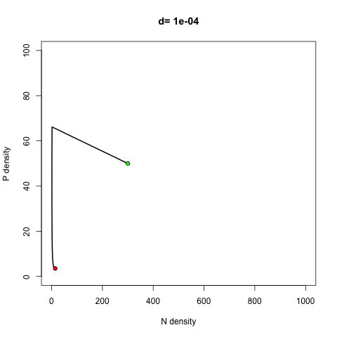

```{r}
require(deSolve)
require(animation)
```

First I'm doing the Pred-Prey portion of the assignment.

I'm just going to define parameter values to be used the rest of the time:
```{r}
b = 0.01 # predator attack rate
c = 0.1*b # predator conversion of preation into reproduction
m = 0.2 # predator mortality
a = 1 # rate of prey capture/unit prey and time
d = 0.0015 # handling time
r = 0.5 # prey growth rate
K = 1000 # prey carrying capacity
```


Now the standard inputs for lsoda for all the pred-prey models:
```{r}
parms <- c(r=r,b=b,c=c,m=m,a=a,d=d,K=K) # named vector of parameters
tf <- 100 # end time
times <- 1:tf
n0 <- c(N=300,P=50) # this just makes n0 a named list, allows you to keep labels which is good
```


Now the first pred-prey function, type 1 functional response and no density dependence:
```{r}
PredPrey1 <- function(t,n,parms){
  with(as.list(c(parms,n)),{
    dN <- r*N - b*N*P
    dP <- c*N*P-m*P
    res <- list(c(dN,dP))
    return(res)
  })
}
```


Run it and plot it, with a green dot at the start and a red dot at the finish:
```{r}
out1 <- as.data.frame(lsoda(n0,times,PredPrey1,parms)) # run lsoda and get the output as data frame

plot(out1$N,out1$P,type="l") # plot outputs
points(out1$N[1],out1$P[1],pch=21,bg="green") # add dots
points(out1$N[length(out1$N)],out1$P[length(out1$P)],pch=21,bg="red")

```


Next, we repeat for type 1 response and density dependence in prey:
```{r}
PredPrey2 <- function(t,n,parms){
  with(as.list(c(parms,n)),{
    dN <- r*N*(1-N/K) - b*N*P # added in density dependence
    dP <- c*N*P-m*P
    res <- list(c(dN,dP))
    return(res)
  })
}

out2 <- as.data.frame(lsoda(n0,times,PredPrey2,parms))

plot(out2$N,out2$P,type="l")
points(out2$N[1],out2$P[1],pch=21,bg="green")
points(out2$N[length(out2$N)],out2$P[length(out2$P)],pch=21,bg="red")
```


Now, type 2 functional response and density dependence in prey:
```{r}
PredPrey3 <- function(t,n,parms){
  with(as.list(c(parms,n)),{
    dN <- r*N*(1-N/K) - b*(N/(1+d*N))*P
    dP <- c*(N/(1+d*N))*P-m*P
    res <- list(c(dN,dP))
    return(res)
  })
}

out3 <- as.data.frame(lsoda(n0,times,PredPrey3,parms))

plot(out3$N,out3$P,type="l")
points(out3$N[1],out3$P[1],pch=21,bg="green")
points(out3$N[length(out3$N)],out3$P[length(out3$P)],pch=21,bg="red")

```


Finally, type 3 functional response and density dependence in prey:
```{r}
PredPrey4 <- function(t,n,parms){
  with(as.list(c(parms,n)),{
    dN <- r*N*(1-N/K) - b*(N^2/(1+d*N^2))*P
    dP <- c*(N^2/(1+d*N^2))*P-m*P
    res <- list(c(dN,dP))
    return(res)
  })
}

out4 <- as.data.frame(lsoda(n0,times,PredPrey4,parms))

plot(out4$N,out4$P,type="l")
points(out4$N[1],out4$P[1],pch=21,bg="green")
points(out4$N[length(out4$N)],out4$P[length(out4$P)],pch=21,bg="red")
```


For fun, here's a gif showing the 4th model results as you change handling time:
```{r,cache=TRUE,message=FALSE}
saveGIF({for( w in seq(from=.0001, to=.005, by=.0001)){
  
  times <- 1:1000
  parms <- c(r=r,b=b,c=c,m=m,a=a,d=w,K=K)
  out5 <- as.data.frame(lsoda(n0,times,PredPrey4,parms))
  plot(out5$N, out5$P, type = "l", xlab = "N density", ylab = "P density",
          main=paste("d=",w), lwd = 2, xlim=c(0,1000), ylim=c(0,100), lty=1)
  points(out5$N[1],out5$P[1],pch=21,bg="green")
  points(out5$N[length(out5$N)],out5$P[length(out5$P)],pch=21,bg="red")}},
  movie.name = "assignment5.gif", interval = 0.3, clean=TRUE)
```




Now I'm giving the competition portion a shot.

First, create the competition function:
```{r}
competition <- function(t,n,parms){
  with(as.list(c(parms,n,a)),{
  dn1 <- r1*n1*(1-n1/K1-a1*n2/K1)
  dn2 <- r2*n2*(1-n2/K2-a2*n1/K2)
  res <- list(c(dn1,dn2))
  return(res)
  })
}
```


Read in data and create lsoda entries:
```{r}
rkt <- as.matrix(read.table("/Users/MJ/GitHub/ECL_233/parameciumrk.txt")) # read in r/k values
colnames(rkt)=NULL # get rid of weird column names

nTrue <- as.matrix(read.table("/Users/MJ/GitHub/ECL_233/paramecium2.txt")) # read in our data
colnames(nTrue)=NULL
parmsrk <- c(r=c(rkt[1,]),K=c(rkt[2,])) # define the r/k parm values based on rkt
n0 <- c(n=c(nTrue[1,1],nTrue[1,2])) # pull first entries for initial pop size
times <- 1:length(nTrue[,1]) # times is length of our data
```


Now the minimization function:
```{r}
compMin <- function(parms){ # don't need initial conditions bc we're putting data in
  out <- as.data.frame(lsoda(n0,times,competition,parms)) # run model with current guess
  mse1 <- mean((out$n1-nTrue[,1])^2) # calculate mean square difference
  mse2 <- mean((out$n2-nTrue[,2])^2)
  sum.mse <- mse1 + mse2 # we want to minimize the errors of functions for BOTH types from the data
  return(sum.mse) # return value we want minimized
} 
```


Run the minimization function with guesses for a:
```{r,message=FALSE,warning=FALSE,results='hide',error=FALSE}
a <- c(1,1) # our best guesses for the a values
optimOut <- optim(par=c(parmsrk,a=a),compMin) # run the optimization function
```


Plot both prediction curves against the real data:
```{r}
out6 <- as.data.frame(lsoda(n0,times,competition,optimOut$par)) # create a curve with the new optimized parameters

plot(out6$time,out6$n1,type="l")
lines(out6$time,out6$n2,col="red")
points(out6$time,nTrue[,1])
points(out6$time,nTrue[,2],col="red")
```

For what I just did, ALL parameters are allowed to be optimized, which leads to r and K values that are different from the inputs we read in from the .txt file, as can be seen below. This might be fine, but if we are very sure of r and K values, perhaps from the empirical study, then we don't want them to be optimized.
```{r}
optimOut$par
```


I'm going to try do do the optimization without changing the r and K values we read in from the start. I used a different optimization method that allows for constraints to be placed on individual parameters. For the first 4 parameter values (r and K), I constrain them to within +/- 0.01 of their initial inputs, which essentially keeps them at the values we put in from the start, while the a values are allowed to optimize from negative to positive infinity.
```{r}
parms.tot <- c(parmsrk,a=a) # this is our total parameter list

optimOut2 <- optim(par=parms.tot,compMin,method="L-BFGS-B",lower=
                     c(parms.tot[[1]]-0.01,
                       parms.tot[[2]]-0.01,
                       parms.tot[[3]]-0.01,
                       parms.tot[[4]]-0.01,-Inf,-Inf), upper=c(parms.tot[[1]]+0.01,
                                                          parms.tot[[2]]+0.01,
                                                          parms.tot[[3]]+0.01,
                                                          parms.tot[[4]]+0.01,Inf,Inf))
```


Check that the constraint worked:
```{r}
optimOut2$par
```


Now plot the new curves against the data:
```{r}
out7 <- as.data.frame(lsoda(n0,times,competition,optimOut2$par)) # create curve w/new parameters

plot(out7$time,nTrue[,1])
points(out7$time,nTrue[,2],col="red")
lines(out7$time,out7$n1)
lines(out7$time,out7$n2,col="red")
```

This method properly constrained the r and K values to the ones we read in, and it ended up generating slightly different looking curves.

You could also just build the r and K values into the competition function itself and then use only a values as parameters for optimization... more than one way to work around it I guess!
