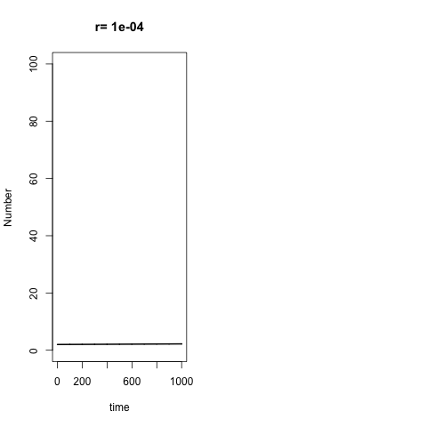

```{r}
library(deSolve)


## First up, the model:

ExpGrow <- function(Time, State, Pars) {
  with(as.list(c(State, Pars)), {
    dPrey <- r*Prey
    
    # r= prey growth rate
    # K= prey carrying capacity
    # s= predator search range
    # t= handling time
    # c= predator death rate
    # d= assimilation efficiency
    
    return(list(c(dPrey)))
  })
}


## This way uses the animation package to call ImageMagick and create straight-to-gif 


## changing handling time

library(animation)

saveGIF({for( w in seq(from=.0001, to=.005, by=.0001)){
  
  pars <- c(r=w)
  
  yini  <- c(Prey = 2)
  times <- seq(0, 1000, by = 1)
  out   <- ode(yini, times, ExpGrow, pars)
  
  
  matplot(out[ , 1], out[ , 2], type = "l", xlab = "time", ylab = "Number",
          main=paste("r=",w), lwd = 2, xlim=c(0,1000), ylim=c(0,100) lty=1)}},
  movie.name = "growth4.gif", interval = 0.3, clean=TRUE)

```


